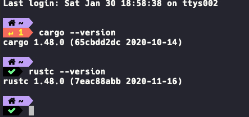

# Rust开发环境搭建

`Rust` 语言的环境配置还是相对简单的，因为官方提供了 `rustup` 这个一步配置工具。`rustup` 是 `Rust` 官方推出的基于 `终端/控制台/shell` 的工具，可用于管理 `Rust` 版本和相关工具。

## Linux和Mac下配置安装环境

`Linux`和`Mac`上配置环境比较简单，你只需要在你的终端里面执行下面命令即可安装:

```shell
curl --proto '=https' --tlsv1.2 -sSf https://sh.rustup.rs | sh
```
查看是否安装成功输入:`rustc --version`即可！




## Windows 上安装 Rust

`Windows` 上安装任何语言的开发环境都有一点复杂，`Rust` 也无法避免这一点，`Windows` 上运行 `Rust` 编译器需要 `C++` 开发环境,推荐的做法是安装 `Visual Studio 2015` 或更高的版本，然后你打[https://www.rust-lang.org/](https://www.rust-lang.org/)下载对应文件即可，双击下载好的 `rustup-init.exe` 文件，选择第`1`项，然后你就一路下一步，一般情况下，只要静静地等待安装完成即可。

`Rust` 被安装到目录 `C:\Users\{PC}\.cargo\bin` 里打开你自己的 `C:\Users\{PC}\.cargo\bin` 目录，可以看到下面的文件列表。

```bash
cargo-fmt.exe
cargo.exe
rls.exe
rust-gdb.exe
rust-lldb.exe
rustc.exe // 这是rust编译器
rustdoc.exe
rustfmt.exe
rustup.exe
```
你也可以把这个目录添加到你系统环境变量里，如果在安装出现了问题你可以加`关于本站`上的讨论组，进来讨论你遇到的问题。


## 介绍一下rustup

> `rustup` 是rust官方的版本管理工具，应当作为安装 Rust 的首选。因为 Rust 的更新速度很快，支持的版本很多，有时新版本是不会完美兼容旧版本的，同时还支持多平台交叉编译，所以就有了 `rustup` 这个 `Rust` 工具链的管理工具。

**特 性** 

  1. 管理安装多个官方版本的 Rust 二进制程序。
  2. 配置基于目录的 Rust 工具链。
  3. 安装和更新来自 Rust 的发布通道: nightly, beta 和 stable。
  4. 接收来自发布通道更新的通知。
  5. 从官方安装历史版本的 nightly 工具链。
  6. 通过指定 stable 版本来安装。
  7. 安装额外的 std 用于交叉编译。
  8. 安装自定义的工具链。
  9. 独立每个安装的 Cargo metadata。
  10. 校验下载的 hash 值。
  11. 校验签名 (如果 GPG 存在)。
  12. 断点续传。
  13. 只依赖 bash, curl 和常见 unix 工具。
  14. 支持 Linux, OS X, Windows(via MSYS2)。

使用`rustup`安装的时候，他会帮你安装一下工具:

-  `rustc` 编译器
- `rust-std` 标准库
- `cargo` 包管理工具
-  `rust-doc` 说明文档

## Hello, Cargo!

`Cargo` 是 `Rust` 的构建系统和包管理器。大多数 `Rustacean` 们使用 Cargo 来管理他们的 Rust 项目，因为它可以为你处理很多任务，比如构建代码、下载依赖库并编译这些库。

- 检测是否安装输入命令`cargo --version`

1. 创建一个基于`cargo`的项目，在你需要工作的目录输入下面命令

``` shell
$ cargo new hello_cargo
$ cd hello_cargo
```


2. 先不急着coding，先看看`Cargo.toml`文件里面是啥

```toml linenums="1"
[package]
# 项目名字
name = "hello_cargo"
# 项目版本
version = "0.1.0"
# 开发者信息
authors = ["Dings <deen.job@qq.com>"]
# edition 字段表明代码应该使用哪个版本编译。如果该字段不存在，其默认为 2015 以提供后向兼容性
edition = "2018"

# See more keys and their definitions at https://doc.rust-lang.org/cargo/reference/manifest.html

# 项目依赖的相关配置
[dependencies]
```
**相关命令**
- `cargo build`  构建了项目
- `cargo run`    编译和运行
- `cargo check`  快速检查代码确保其可以编译
- `cargo build --release` 来优化编译项目

